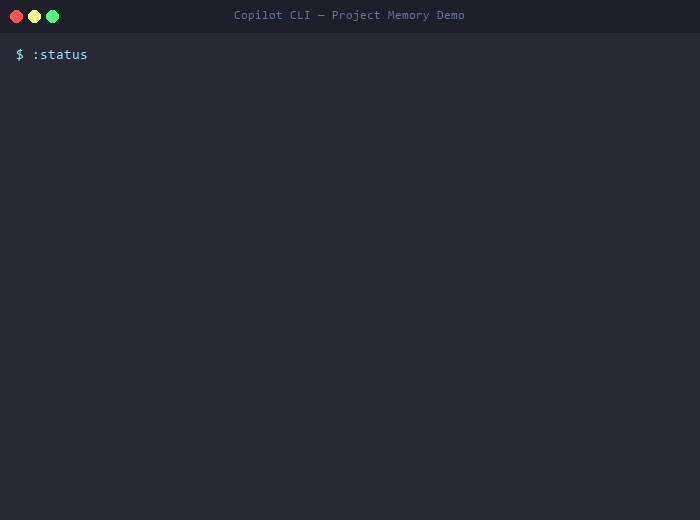

# 📂 Copilot Project Memory

> **Give GitHub Copilot CLI a long-term memory — per project, per machine, zero repo pollution.**

[](LICENSE)

One-time install. Works forever. No runtime, no dependencies — just a slim prompt + bundled CLI tools.

---

## ✨ What It Does

Every time you open Copilot CLI in a project folder, it **remembers everything**:

| Feature | What It Remembers |
|---------|-------------------|
| 🔧 **Preferences** | Language, framework, indent style, package manager |
| ✅ **Do's & Don'ts** | "Always use named exports", "Never use `any` type" |
| 📦 **Project Context** | Tech stack, key files, architecture notes |
| 🧩 **IDE Extensions** | ESLint, Prettier, Tailwind — per project |
| 📝 **Code Snippets** | Reusable patterns saved and recalled by name |
| 🕐 **Session History** | Resume where you left off or start fresh |
| 🔀 **Named Sessions** | Work on multiple features — switch context like branches |
| 🌍 **Global Rules** | Personal defaults that apply across ALL projects |
| 🔄 **Pipeline Executor** | Deterministic step-by-step task execution with verification |

### Architecture (v2)

**Hybrid approach — simple + reliable:**

```
Simple ops (fast, AI handles inline)     Complex ops (CLI tools, deterministic)
┌─────────────────────────┐             ┌────────────────────────────┐
│ :remember, :forget      │             │ copilot-memory verify      │
│ :rules, :prefs, :status │  AI reads/  │ copilot-memory compact     │
│ :context, :resume       │  writes     │ copilot-memory init        │
│ session auto-save       │  YAML       │ copilot-memory export      │
│ :help                   │  directly   │ copilot-memory schema-fix  │
└─────────────────────────┘             │ pipeline run/verify/show   │
                                        └────────────────────────────┘
```

- **Slim prompt (~800 tokens)** tells the AI what tools exist and how to handle simple commands
- **`copilot-memory` CLI** handles integrity checks, storage caps, schema validation — with Pydantic models and atomic writes
- **`pipeline` CLI** handles deterministic pipeline execution with hash-chained audit trails

---

## 🎬 See It In Action

<p align="center">
  
</p>

<details>
<summary>Text version (if GIF doesn't load)</summary>

```
You: :status
🧠 Project: my-api | 4 rules | 3 prefs | 12 sessions
   Stack: Node.js, Express, TypeScript
   Last session: 2h ago — "Added rate limiting to auth endpoints"

You: :resume
📌 Resuming: "Added rate limiting to auth endpoints"
   Files: src/auth/middleware.ts, src/api/routes.ts
   Decision: Use sliding window algorithm for rate limits

You: :remember Never use any type in this project
✅ Remembered as a don't: "Never use any type in this project"

You: :remember Always validate API inputs with Zod
✅ Remembered as a do: "Always validate API inputs with Zod"
```

Next time you open Copilot in that project — **it already knows your rules, your context, and where you left off.**

</details>

---

## 🚀 Install (One Time, Any Machine)

### Windows (PowerShell)
```powershell
# Clone and install:
git clone https://github.com/KoushikMakam/copilot-project-memory.git
cd copilot-project-memory
.\install.ps1

# Or one-liner remote install:
irm https://raw.githubusercontent.com/KoushikMakam/copilot-project-memory/main/install.ps1 | iex
```

### macOS / Linux
```bash
# Clone and install:
git clone https://github.com/KoushikMakam/copilot-project-memory.git
cd copilot-project-memory
bash install.sh

# Or one-liner remote install:
curl -fsSL https://raw.githubusercontent.com/KoushikMakam/copilot-project-memory/main/install.sh | bash
```

### What the installer does:
1. Creates `~/.copilot/project-memory/` with global and template folders
2. Installs the **slim prompt** into `~/.copilot/copilot-instructions.md` (~800 tokens)
3. **Auto-discovers and installs all tools from `tools/`** (e.g., `pipeline`, `copilot-memory`)
4. Adds a `ghc` shell alias (auto-grants memory path access)
5. Seeds file permissions for the current project directory
6. **Auto-whitelists tools** with Windows Defender Controlled Folder Access (if enabled)

> **Prerequisites:** Python 3.10+ with pip (for bundled tools). The memory system itself works without Python — tools are optional but recommended.

> **Windows Defender note:** If you use Controlled Folder Access, the installer auto-whitelists tools. If it can't (needs admin), run `scripts/fix-windows-defender.ps1` as Administrator.

> **That's it.** Open Copilot in any project folder and it just works.

---

## 🔐 Permissions

Copilot CLI only reads/writes files inside your working directory by default. Since project memory lives in `~/.copilot/project-memory/` (outside your repo), Copilot needs explicit access.

The installer handles this automatically. Three options if you need to grant access manually:

| Method | How | Scope |
|--------|-----|-------|
| **`ghc` alias** (recommended) | Just type `ghc` instead of `gh copilot` | All projects, always |
| **Re-run installer** | `cd my-project && .\install.ps1` | That project |
| **In-session command** | Type `/add-dir ~/.copilot/project-memory` | Current session |

---

## 📖 Usage

### Automatic (no commands needed)

| When | What Happens |
|------|-------------|
| **First time in a folder** | Auto-detects stack (package.json, Cargo.toml, etc.), creates project memory |
| **Returning to a folder** | Loads your memory, hints to resume last session |
| **During a session** | Saves incrementally after each meaningful interaction — never loses progress |
| **During a session** | Detects repeated corrections → suggests saving as rules |
| **End of session** | Final save with closed status (but data is already safe from incremental saves) |

### Commands

All commands use the **`:` prefix** to avoid accidental triggers. Type them as regular chat messages.

> 💡 Type **`:help`** or **`:?`** to see all available commands anytime.

#### Quick Start
```
:status                                          — Load memory & show overview
:resume                                          — Resume where you left off
:help                                            — Show all commands
```

#### Remember & Forget
```
:remember Always use Zod for API validation      → Asks: project or global? → ✅ Saved
:remember Never use default exports              → Asks: project or global? → ✅ Saved
:remember global I prefer concise answers        → ✅ Saved directly as global rule
:remember project Use pnpm here                  → ✅ Saved directly as project rule
:forget never-use-default-exports                → ✅ Rule removed
```

#### Memory Management
```
:prefs                    — List preferences
:prefs set key value      — Set a preference (e.g., :prefs set language typescript)
:rules                    — List all do's and don'ts
:rules add do: <desc>     — Add a "do" rule
:rules add dont: <desc>   — Add a "don't" rule
:rules touch <id>         — Mark a rule as still relevant
:context                  — Show project context
:context stack next.js    — Add to tech stack
:extensions               — List saved IDE extensions
:extensions add <id>      — Save an extension
:sessions                 — Browse session history
:stats                    — Stats across ALL projects
:tracking                 — View auto-learned patterns
:compact                  — Prune stale data & enforce storage caps
:verify                   — Check memory file integrity
```

#### Snippets
```
:snippets save api-handler    — Save last code block as a named snippet
:snippets get api-handler     — Retrieve a snippet
:snippets list                — List all snippets
```

#### Named Sessions (Multiple Features)

Working on multiple features in the same project? Use named sessions — like branches for your Copilot context:

```
:session new auth-refactor    — Start a named session
:session new api-migration    — Start another one
:session load auth-refactor   — Switch back to a session
:session list                 — Show all named sessions
:session save <name>          — Save current work to a named session
:session notes <text>         — Add a note to the active session
:session delete <name>        — Remove a named session
```

Auto-save writes to the **active named session** automatically. `:resume` picks up wherever you left off.

#### Pipeline Executor (Deterministic Task Execution)

Force Copilot to decompose, verify, and audit every step of complex tasks — with **two-layer verification**:

```
:pipeline <task>          — Run a task with verified step-by-step execution
:pipeline resume          — Resume an interrupted pipeline
:pipeline last            — Show last pipeline report
:pipeline history         — Show all past pipeline runs
:pipeline auto on|off     — Toggle auto-detection (default: on)
:pipeline stop            — Disable pipeline mode
```

**How it works:**
1. **DECOMPOSE** — AI breaks your task into atomic steps with pre/post checks
2. **STORE & APPROVE** — Plan saved to disk as YAML, shown as visual workflow, you approve
3. **EXECUTE** — Each step runs with evidence-based verification
4. **VERIFY (two layers):**
   - **Code verification:** Copilot internally runs `pipeline verify` — deterministic postcondition checking against the real filesystem (no AI judgment)
   - **AI verification:** A rubber-duck agent independently checks compliance against the approved plan
5. **REPORT** — Summary table with pass/fail status and evidence

**Why two layers?** AI alone is ~60% reliable at following complex instructions. Code verification catches objective failures (missing files, wrong exit codes). AI verification catches structural issues (missing steps, wrong order). Combined: ~98% compliance.

Auto-activates for multi-step tasks (3+ steps) or trigger manually with `:pipeline`.

```
User: "Set up the dev environment"

🔄 Pipeline mode activated

═══ PIPELINE WORKFLOW ═══
  ┌──────────┐     ┌──────────┐
  │ 1. check  │     │ 2. clone │
  │   python  │     │   repo   │
  └────┬─────┘     └────┬─────┘
       └──────┬─────────┘
              ▼
       ┌────────────┐
       │ 3. install  │
       └──────┬─────┘
              ▼
       ┌────────────┐
       │ 4. test     │
       └────────────┘
  ⏳ Approve this plan?
═══════════════════════

After approval, each step runs with:
  📋 PRE-CHECK  → ✅/❌ with evidence
  🔨 EXECUTE    → actual work
  📋 POST-CHECK → ✅/❌ with proof
  📊 RESULT     → pass/fail
```

#### Team Sharing & Multi-Editor
```
:export team              — Generate .github/copilot-instructions.md (shared rules only)
:export team --all-rules  — Include all rules, not just shared ones
:export team --scope=rules,stack  — Export specific categories only
:export team --fresh=30d  — Only items used in last 30 days
:export team --max-size=4kb — Cap export file size
:export editors           — Generate instruction files for VS Code, JetBrains, Neovim, Claude Code, Cursor
```

#### Auto-Export to Editors (New!)

Enable once — never manually export again:
```
:prefs set auto_export_editors true
```

When enabled, `.github/instructions/project-memory.instructions.md` is **automatically regenerated** whenever you:
- `:remember` or `:forget` a rule
- `:prefs set` a preference
- `:context set` or `:context stack`
- `:tracking promote` a pattern

This file lives **alongside** `.github/copilot-instructions.md` (team instructions) — they never conflict:
- `.github/copilot-instructions.md` → team rules (manual, committed)
- `.github/instructions/project-memory.instructions.md` → your memory (auto-generated, gitignored by default)

VS Code and JetBrains read both locations automatically. No restart needed.

> 💡 Enabled **globally by default** after install. Disable per-project with `:prefs set auto_export_editors false`.
> To share with teammates, remove the gitignore entry for this file.

#### Backup, Restore & Reset
```
:backup                   — Archive all memory to a file
:restore <path>           — Restore from a backup
:reset                    — Wipe this project's memory (asks confirmation)
```

---

## 🧹 Storage Management

Memory doesn't grow forever. The system enforces **hard caps** and provides tools to keep things clean:

| Data | Max | What Happens |
|------|-----|--------------|
| Default sessions | 10 | Oldest auto-deleted on save |
| Named session entries | 20 per session | Oldest auto-deleted |
| Hotspots (tracking) | 5 | Lowest touch_count dropped |
| Error patterns (tracking) | 10 | Oldest dropped |
| Explicit rules | ∞ | **Never auto-deleted** |

### Staleness Tracking

Rules and preferences gain `last_used` and `use_count` metadata (best-effort). This helps `:compact` identify stale entries — but **explicit user rules are never auto-archived**.

### Commands

```
:compact                  — Enforce caps, report stale items
:compact --aggressive     — Also archive old tracking + reset stats
:verify                   — Check all memory files for integrity (non-destructive)
:rules touch <id>         — Mark a rule as still relevant
```

### Team Export (Selective)

`:export team` only includes rules marked `share: true` by default. When you `:remember` a rule, you'll be asked if it should be shared. This prevents accidental contamination of team instructions.

```
:export team --all-rules  — Override: include all rules
:export team --scope=rules,stack --fresh=30d --max-size=4kb
```

---

## 📁 Storage Layout

Everything lives **outside your repos** in `~/.copilot/project-memory/`:

```
~/.copilot/
  ├── copilot-instructions.md       # The "brain" — master prompt (installed by installer)
  └── project-memory/
      ├── _global/                   # Your personal defaults (all projects)
      │   ├── preferences.yml
      │   ├── rules.yml
      │   └── snippets/
      ├── _template/                 # Template for new projects
      └── my-app-a3f2b1c8/          # Per-project memory (auto-created)
          ├── preferences.yml        # Language, framework, style
          ├── rules.yml              # Do's and don'ts
          ├── context.yml            # Stack, key files, description
          ├── extensions.yml         # IDE extensions
          ├── tracking.yml           # Auto-learned patterns
          ├── sessions/              # Session history
          │   ├── latest.json        # Active session pointer
          │   ├── _default/          # Auto-saved unnamed sessions
          │   ├── auth-refactor/     # Named session (feature branch)
          │   └── api-migration/     # Another named session
          └── snippets/              # Reusable code patterns
```

**Conflict resolution:** Project rules always override global rules.

---

## 🧰 Bundled Tools

Tools live in the `tools/` directory and are auto-installed by the installer. Each tool is a standalone Python package with its own `pyproject.toml`.

```
tools/
├── pipeline/                       # Pipeline verification engine
│   ├── pyproject.toml
│   ├── pipeline/
│   │   ├── cli.py                  # CLI: pipeline run|verify|show
│   │   ├── engine.py               # Deterministic execution loop
│   │   ├── models.py               # Pydantic models (Step, DAG, Audit)
│   │   ├── checks.py               # Postcondition evaluator
│   │   └── loader.py               # YAML plan loader
│   ├── tests/                      # 31 tests
│   └── examples/                   # Example pipeline YAML files
│
└── copilot-memory/                 # Memory management CLI (NEW in v2)
    ├── pyproject.toml
    ├── copilot_memory/
    │   ├── cli.py                  # CLI: 6 commands (status, verify, compact, init, schema-fix, export)
    │   ├── models.py               # Pydantic schemas (Rule, Context, Session)
    │   └── store.py                # File I/O with validation, atomic writes, BOM handling
    └── tests/                      # 56 tests (models, store, CLI integration)
```

### copilot-memory CLI (New in v2)

Deterministic memory management — the AI calls this for complex operations:

```bash
copilot-memory status              # Show project memory overview
copilot-memory verify              # Check integrity of all memory files
copilot-memory verify --fix        # Auto-fix integrity issues (dangling sessions, ID mismatches)
copilot-memory compact             # Enforce storage caps, prune stale data
copilot-memory init                # Initialize memory for a new project
copilot-memory schema-fix          # Add missing schema_version headers to YAML files
copilot-memory export team         # Export shared rules to .github/copilot-instructions.md
copilot-memory export stdout       # Export to stdout (for piping)
```

**What it handles that the AI doesn't:**
- **Schema validation** — Pydantic models enforce correct YAML structure
- **Atomic writes** — tmp file + rename prevents corruption on crash
- **BOM handling** — Reads UTF-8 with or without BOM (PowerShell writes BOM)
- **Session integrity** — Detects dangling pointers, ID mismatches, empty sessions
- **Storage caps** — Enforces hard limits on sessions, hotspots, error patterns

### pipeline CLI

The bundled pipeline verification engine. Copilot calls this internally — **you never need to run it manually**.

```bash
pipeline verify <plan.yaml>   # Check postconditions (no execution)
pipeline run <plan.yaml>      # Execute pipeline with shell commands
pipeline show <plan.yaml>     # Display plan as workflow diagram
```

---

## 🌍 Global Rules

Some rules should apply everywhere. You can set them explicitly:

```
:remember global I prefer concise answers        → saved to _global/rules.yml
:rules add global do: I prefer concise answers
:rules add global dont: Never include unnecessary comments
```

Or just use `:remember <rule>` — you'll be prompted to choose **project** or **global** scope.

These live in `_global/rules.yml` and are loaded for every project. Project rules override global rules when they conflict.

---

## 🔍 Auto-Detection

On first open in a new folder, Copilot scans for project files and auto-detects your stack:

| File | Detected As |
|------|------------|
| `package.json` | Node.js + framework (Next.js, React, Vue, etc.) |
| `requirements.txt` / `pyproject.toml` | Python + framework (Django, Flask, FastAPI) |
| `Cargo.toml` | Rust |
| `go.mod` | Go |
| `pom.xml` / `build.gradle` | Java (Maven / Gradle) |
| `*.csproj` / `*.sln` | .NET (C#) |
| `Gemfile` | Ruby |
| `composer.json` | PHP |
| `pubspec.yaml` | Dart / Flutter |

---

## 🤝 Team Sharing

Share your project's rules with teammates without requiring them to install anything:

```
:export team
```

This generates a `.github/copilot-instructions.md` file in your repo with your project context, rules, and preferences — readable by any Copilot-enabled editor (VS Code, JetBrains, Neovim, etc.).

**What gets exported:** Project context, rules, preferences, architecture patterns
**What stays private:** Session history, personal style preferences, error patterns

---

## ❓ FAQ

**Q: Does this add files to my repo?**
A: No. Everything lives in `~/.copilot/project-memory/`. Zero repo pollution. Only `:export team` writes to your repo (intentionally).

**Q: Do I need Node.js or any runtime?**
A: Python 3.10+ with pip is recommended for bundled tools (like `pipeline`). The memory system itself works without Python — tools add deterministic verification for complex tasks.

**Q: How does it work without code?**
A: The slim prompt (~800 tokens) tells Copilot the memory system exists and how to use it. Simple ops (`:remember`, `:rules`) are handled by the AI directly reading/writing YAML. Complex ops (`:verify`, `:compact`) delegate to the `copilot-memory` CLI for deterministic execution. Pipeline verification uses the `pipeline` CLI.

**Q: Can my team use this?**
A: Use `:export team` to generate a `.github/copilot-instructions.md` — teammates get your rules automatically, no install needed.

**Q: How do I move to a new machine?**
A: Use `:backup` on the old machine, copy the archive, and `:restore <path>` on the new one. Or re-run the installer and start fresh.

**Q: What if global and project rules conflict?**
A: Project rules always win. Global rules are defaults that can be overridden per-project.

**Q: Does it work with VS Code / JetBrains Copilot?**
A: Yes! Enable `auto_export_editors` (on by default) and your rules/preferences automatically sync to `.github/copilot-instructions.md` which VS Code and JetBrains read natively. You can also run `:export editors` to generate files for Neovim, Cursor, and Claude Code.

---

## 📄 License

MIT — use it, fork it, make it yours.
